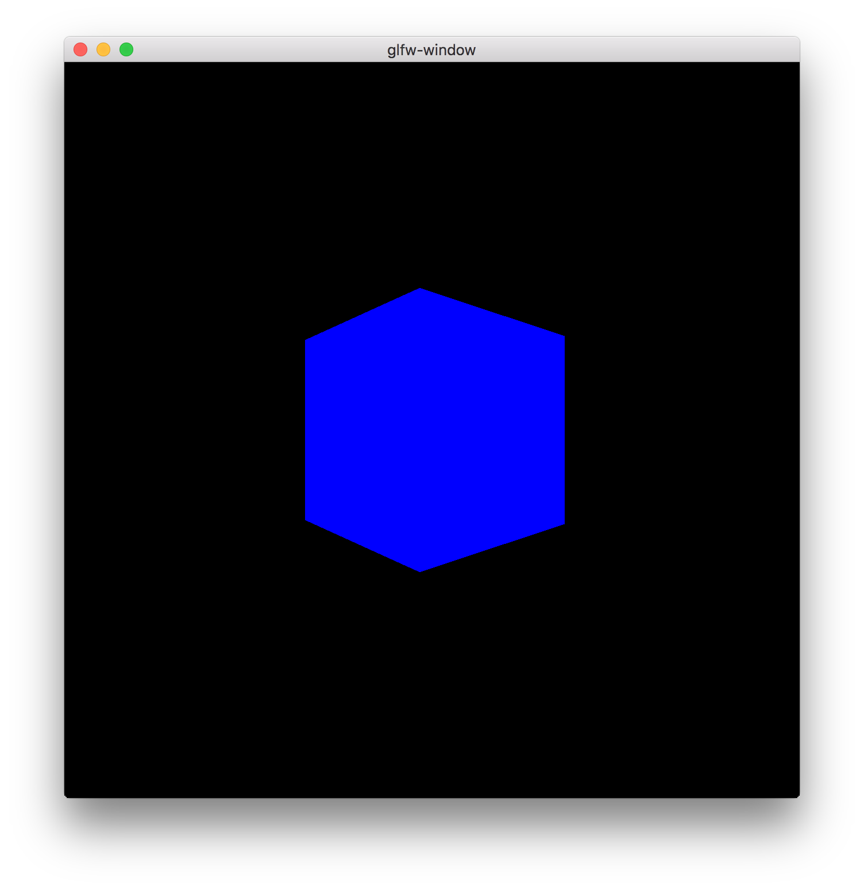

glisy
=====

Higher level operations for OpenGLES in C(99)

## Installation

With [clib](https://github.com/clibs/clib):

```sh
$ clib install glisy/glisy --save
```

From source:

```sh
$ make
$ make install
```

## Status

WIP - Active development

## Example

The following example draws a rotating cube:



with the following shader code:

***vertex***:

```glsl
#version 400

precision mediump float;
uniform mat4 projection;
uniform mat4 model;
uniform mat4 view;
in vec3 position;

void main(void) {
  gl_Position = projection * view * model * vec4(position, 1.0);
}
```

***fragment***:

```glsl
#version 400

precision mediump float;
uniform vec3 color;
out vec4 fragColor;

void main(void) {
  fragColor = vec4(color, 1);
}
```

and the following C code:

```c
#include <glisy/geometry.h>
#include <glisy/camera.h>
#include <glisy/color.h>
#include <glisy/math.h>
#include "util.h"

#define WINDOW_NAME "CubeExample"
#define WINDOW_WIDTH 640
#define WINDOW_HEIGHT 640

// model
typedef struct Cube Cube;
struct Cube {
  // glisy
  GlisyGeometry geometry;
  GlisyUniform model;

  // model
  vec3 position;
  mat4 transform;
  mat4 rotation;

  // vao
  int faceslen;
};

static mat4 transform;
static float aspect = (float) WINDOW_WIDTH / (float) WINDOW_HEIGHT;
static float near = 1.0;
static float far = 1000.0;
static float fov = M_PI / 2.0;
static Cube cube;

static GlisyProgram program;
static GlisyCamera camera;
static GLFWwindow *window;

static void InitializeCube(Cube *cube);
static void UpdateCube(Cube *cube);
static void RotateCube(Cube *cube, float radians, vec3 axis);

void InitializeCube(Cube *cube) {
  static const vec3 vertices[] = {
    vec3(-0.5, -0.5, +0.5),
    vec3(+0.5, -0.5, +0.5),
    vec3(-0.5, +0.5, +0.5),
    vec3(+0.5, +0.5, +0.5),

    vec3(-0.5, -0.5, -0.5),
    vec3(+0.5, -0.5, -0.5),
    vec3(-0.5, +0.5, -0.5),
    vec3(+0.5, +0.5, -0.5),
  };

  static const GLushort faces[] = {
    0, 1, 3, 0, 3, 2,
    1, 5, 7, 1, 7, 3,
    5, 4, 6, 5, 6, 7,
    4, 0, 2, 4, 2, 6,
    4, 5, 1, 4, 1, 0,
    2, 3, 7, 2, 7, 6,
  };

  // init color
  GlisyColor color;
  glisyColorInit(&color, "blue", 0);

  // init uniforms
  GlisyUniform ucolor;
  glisyUniformInit(&ucolor, "color", GLISY_UNIFORM_VECTOR, 3);
  glisyUniformInit(&cube->model, "model", GLISY_UNIFORM_MATRIX, 4);

  // set uniforms
  glisyUniformSet(&ucolor, &(vec3){color.r, color.g, color.b}, sizeof(vec3));
  glisyUniformBind(&ucolor, 0);

  cube->position = vec3(0, 0, 0);
  cube->faceslen = sizeof(faces) / sizeof(GLushort);
  GLuint size = sizeof(vertices);

  GlisyVAOAttribute position;
  memset(&position, 0, sizeof(position));
  position.buffer.data = (void *) vertices;
  position.buffer.type = GL_FLOAT;
  position.buffer.size = size;
  position.buffer.usage = GL_STATIC_DRAW;
  position.buffer.dimension = 3;

  // init matrices
  mat4_identity(cube->transform);
  mat4_identity(cube->rotation);

  // init vao attributes
  glisyGeometryInit(&cube->geometry);
  glisyGeometryAttr(&cube->geometry, "position", &position);
  glisyGeometryFaces(&cube->geometry,
                       GL_UNSIGNED_SHORT,
                       cube->faceslen,
                       (void *) faces);

  // update geometry with attributes and faces
  glisyGeometryUpdate(&cube->geometry);

  // update cube model
  UpdateCube(cube);
}

void UpdateCube(Cube *cube) {
  mat4 model = mat4_multiply(mat4(), cube->rotation);
  glisyUniformSet(&cube->model, &model, sizeof(model));
  glisyUniformBind(&cube->model, 0);
}

void DrawCube(Cube *cube) {
  UpdateCube(cube);
  glisyGeometryBind(&cube->geometry, 0);
  glisyGeometryDraw(&cube->geometry, GL_TRIANGLES, 0, cube->faceslen);
  glisyGeometryUnbind(&cube->geometry);
}

void
RotateCube(Cube *cube, float radians, vec3 axis) {
  (void) mat4_rotate(cube->rotation, radians, axis);
}

int main(void) {
  // init gl
  GLFW_SHELL_CONTEXT_INIT(3, 2);
  GLFW_SHELL_WINDOW_INIT(window, WINDOW_WIDTH, WINDOW_HEIGHT);
  glfwSetWindowUserPointer(window, &camera);

  // create shader program (util.h)
  program = CreateProgram("cube.v.glsl", "cube.f.glsl");

  // init objects
  InitializeCube(&cube);

  // bind current shader program
  glisyProgramBind(&program);

  // configure camera
  glisyCameraInitialize(&camera);

  // move camera away from cube
  camera.position = vec3(0, 0, -2);

  // update camera state (util.h)
  UpdateCamera(&camera, &program, mat4(), fov, aspect, near, far);

  GLFW_SHELL_RENDER(window, {
    const float angle = glfwGetTime() * 45.0f;
    const float radians = dtor(angle);

    // width/height from `GLFW_SHELL_RENDER' macro
    aspect = (float) width / (float) height;

    // update camera state (util.h)
    UpdateCamera(&camera, &program, mat4(), fov, aspect, near, far);

    //rotate cube in opposite direction
    RotateCube(&cube, radians, vec3_negate(vec3(0, 1, 0)));

    // draw cube to screen
    DrawCube(&cube);
  });

  return 0;
}
```

## License

MIT
